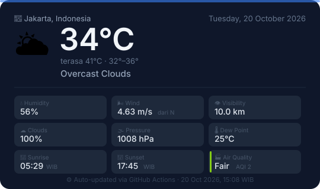

# 🌦️ Jakarta Weather Tracker

> Jakarta weather auto-updated via [OpenWeatherMap](https://openweathermap.org/) · Updates: 07:00 – 22:00 WIB

---

## 📊 Moderate Rain — Thursday, 29 October 2026

| | | | |
|:---:|:---|:---:|:---|
| 🌡️ | **Temperature** &nbsp; `29°C` *(feels like 33°C)* | 💧 | **Humidity** &nbsp; `74%` |
| 🌡️ | **Min / Max** &nbsp; `28° / 30°` | ☁️ | **Cloud Cover** &nbsp; `40%` |
| 🌬️ | **Wind** &nbsp; `2.06 m/s` from `S` | 👁️ | **Visibility** &nbsp; `6.0 km` |
| 🌫️ | **Pressure** &nbsp; `1014 hPa` | 🌧️ | **Rain (1h)** &nbsp; `1.55 mm` |
| 🌅 | **Sunrise** &nbsp; `05:26 WIB` | 🌇 | **Sunset** &nbsp; `17:45 WIB` |
| 🏭 | **Air Quality** &nbsp; Good 🟢 (AQI 1) | 🕗 | **Updated** &nbsp; `29 October 2026, 20:59 WIB` |

---

## 📂 Data & Log

| File | Description |
|:---|:---|
| 📄 [weather.json](./weather.json) | Latest raw weather data from API |
| 🎨 [card.svg](./card.svg) | Weather card (SVG) |
| 📁 [history/](./history) | Weather snapshots per session |

---

⚙️ Automated by [GitHub Actions](../../actions) · Source: OpenWeatherMap API
